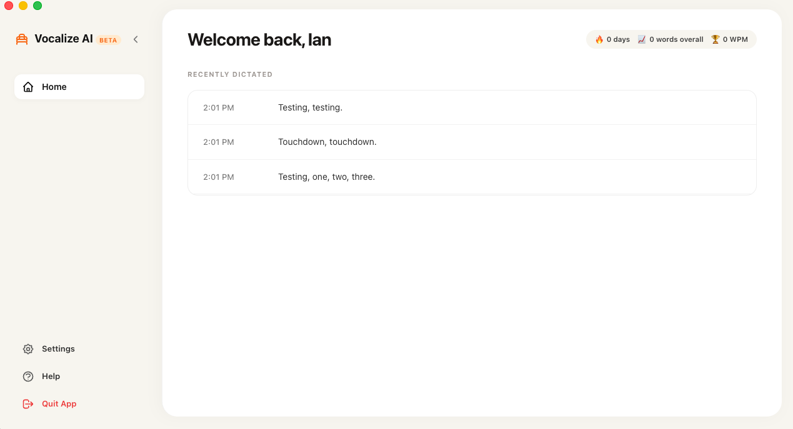
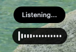
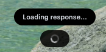
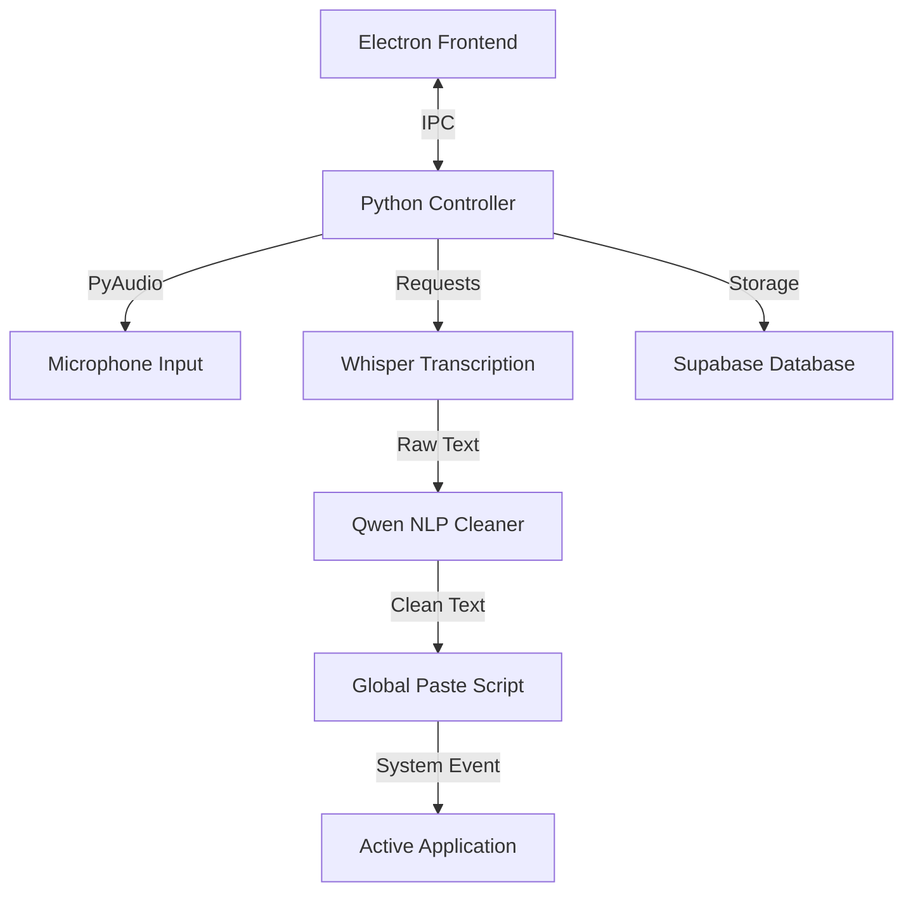

#  Vocalize AI

[](https://github.com/iansonoda/vocalize-ai)
[](https://opensource.org/licenses/ISC)
[](https://www.electronjs.org/)
[](https://www.python.org/)

**Vocalize AI** is a premium, open-source AI dictation & transcription tool designed to streamline your workflow. It captures your speech, cleans it using state-of-the-art AI models, and inserts it directly into any active application—all with a single hotkey.

---

## ✨ Features

- **🚀 Global Hotkey (`Right Option`)**: Trigger recording from anywhere in macOS.
- **🎙️ Precision Transcription**: Powered by **OpenAI Whisper-large-v3** via Hugging Face.
- **🧹 Intelligent AI Cleaner**: Automatically removes "ums", "uhs", and stutters while preserving your original intent.
- **📝 Context-Aware Formatting**: Detects lists, bullet points, and punctuation cues like "new line" or "colon".
- **⚡ Direct Insertion**: Instantly pastes cleaned text into your active text field (Word, Slack, Browser, etc.).
- **📊 Transcription History**: Local dashboard to view, copy, and manage your past dictations.
- **🔴 Dynamic Overlay**: A minimalist recording orb that provides real-time visual feedback and audio waveforms.

---

## 🛠️ Technology Stack

| Layer             | Technology             | Service                   |
| :---------------- | :--------------------- | :------------------------ |
| **Frontend**      | Electron & TailwindCSS | Native Desktop Experience |
| **Logic**         | Python 3.10+           | Audio Processing & IPC    |
| **Transcription** | Whisper Large v3       | Hugging Face Inference    |
| **NLP Cleanup**   | Qwen 2.5 Coder 32B     | Hugging Face Inference    |
| **Database**      | PostgreSQL             | Supabase                  |

---

## � Getting Started

### 1. Prerequisites

- **macOS** (Built specifically for the Mac ecosystem).
- **Python 3.10+** and **Node.js**.
- A **Hugging Face API Token** (available [here](https://huggingface.co/settings/tokens)).
- A **Supabase Project** for data persistence.

### 2. Installation & Setup

The easiest way to get started is using the provided run script:

```bash
# Clone the repository
git clone https://github.com/iansonoda/vocalize-ai.git
cd vocalize-ai

# Configure your environment
cp .env.template .env
# Edit .env with your HUGGINGFACE_API_TOKEN and DATABASE_URL
```

### 3. Launching the App

Simply run the launch script. It will automatically handle virtual environment creation, dependency installation, and start the application.

```bash
chmod +x run.sh
./run.sh
```

---

## 🕹️ Usage

1. **Start the App**: The dashboard will open, and a recording orb will appear at the bottom of your screen.
2. **Global Recording**: Press the **`Right Option`** key to start recording.
3. **Speak Naturally**: Dictate your thoughts. You can use cues like _"bullet point"_ or _"next line"_.
4. **Finish**: Press **`Right Option`** again. The tool will transcribe, clean, and paste the text into your active window.

> [!TIP]
> You can switch between **Plain** and **List** modes in the Dashboard to force specific formatting styles.

---

## 📸 Screenshots

### Dashboard

The main dashboard gives you access to history, formatting modes, and the app controls.



### Recording States

The overlay stays visible while dictating, reacts to hover, and shows loading feedback while the transcript is being processed.

<p align="center">
  
  
  
</p>

---

## 🏗️ Architecture



---

## 🛡️ Permissions (macOS)

To function correctly, Vocalize AI requires:

- **Accessibility**: To simulate `Cmd+V` for pasting text.
- **Input Monitoring**: To detect the global `Right Option` hotkey.
- **Microphone**: To capture your voice.

---

## 🤝 Contributing

Contributions are what make the open-source community such an amazing place to learn, inspire, and create. Any contributions you make are **greatly appreciated**.

1. Fork the Project
2. Create your Feature Branch (`git checkout -b feature/AmazingFeature`)
3. Commit your Changes (`git commit -m 'Add some AmazingFeature'`)
4. Push to the Branch (`git push origin feature/AmazingFeature`)
5. Open a Pull Request

---

## 📜 License

Distributed under the **ISC License**. See `LICENSE` for more information.

---

<p align="center">Built with 💙 by the Vocalize AI Team</p>
